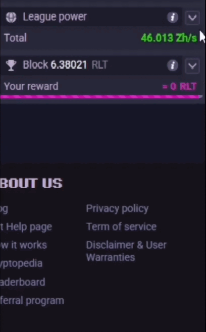

# 🎮 RollerCoin League Calculator

A simple calculator for the new **RollerCoin League system**.  
Check your mining earnings in **Coins, USD, and EUR**, with live prices from CoinGecko.  

---

## ✨ Features
- 🏆 **League system support** (Bronze → Diamond).  
- 💰 **Earnings table**: per block, daily, weekly, monthly.  
- 💱 **Currency modes**: Coins, USD, EUR.  
- ⏳ **Withdrawal estimate** based on minimum withdrawal amounts.  
- 📱 **Responsive**: works on desktop and mobile.  

---

## 🚀 Live Demo
👉 [Open the calculator](https://iamyahyr.github.io/rollercoin-league-calculator/)  

---

## 🕹️ How to use
1. **Enter your Mining Power** in the `Mining Power` field.  
   - Select the correct unit (GH/s, PH/s, EH/s, ZH/s).  
2. Go to RollerCoin → **League Power** → open the dropdown and **copy all the content**.  
    
3. Paste that content into the `Network Data` box.  
4. Done ✅ The calculator will show your earnings in three tabs:  
   - **Coins**  
   - **USD**  
   - **EUR**  

Each mode displays:  
- Earnings **per block**, **daily**, **weekly**, **monthly**.  
- **Withdrawal time estimate** → how long it may take to reach the minimum withdrawal (⚠️ this can vary as the network changes).  

---

## 👨‍💻 Author
Made with ❤️ by [**iamyahyr**](https://rollercoin.com/p/iamyahyr)  
